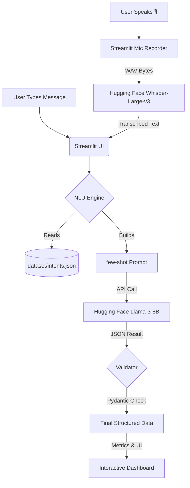

# 🤖 BotTrainer - Llama-3 + Whisper NLU Dashboard

**BotTrainer** is a professional-grade Natural Language Understanding (NLU) development platform designed for speed, cost-efficiency, and modern AI engineering. Instead of training traditional Machine Learning models, BotTrainer leverages **Zero-Shot & Few-Shot Prompting** using **Meta Llama-3-8B** alongside **OpenAI Whisper** via Hugging Face to perform voice-to-text, intent classification, and entity extraction in real-time.

---

## 📽️ Project Architecture Pipeline

Understanding how text (or voice!) moves from a user's input to a structured AI decision is key. Here is the lifecycle of a request in BotTrainer:



---

## 📁 Folder & File Breakdown

### 1. `core/` — The Engine Room
The logic that powers the AI intelligence.
*   **`llm_client.py`:** Manages the connection to the Hugging Face Inference API. It handles token security (via `.env`), dynamic model loading, and robust JSON extraction from raw AI text.
*   **`nlu_engine.py`:** The "brains." It takes the user's intent dataset and transforms it into a smart prompt that teaches the LLM how to behave as a classifier on the fly.
*   **`validator.py`:** A safety layer using `pydantic`. It ensures the AI's response is a valid JSON object with the exactly required fields (`intent`, `confidence`, `entities`).

### 2. `dataset/` — The Knowledge Base
The data that defines your bot's personality and capabilities.
*   **`intents.json`:** Your primary configuration file. Edit this to add new intents, examples, or entity types. No training required!
*   **`generate_data.py`:** A utility script to automatically generate hundreds of synthetic training examples for testing your bot's accuracy.

### 3. `evaluation/` — Quality Assurance
Tools to mathematically prove if your bot is actually working.
*   **`evaluator.py`:** Runs a "Stress Test." It picks random sentences from your dataset, asks the AI to guess them, and calculates **Accuracy**, **Precision**, and **F1-Score**. It also generates the interactive **Confusion Matrix** for the UI.

### 4. `root / styling`
*   **`streamlit_app.py`:** The main entry point. A modern, interactive web dashboard built with Streamlit.
*   **`style.css`:** Custom CSS implementing a "Glassmorphism" premium theme with neon accents and micro-animations.
*   **`.env`:** (User Created) Stores your sensitive Hugging Face API token securely.

---

## 🚀 Quick Start Guide

### 🔧 1. Prerequisites
Ensure you have Python 3.9+ installed and a [Hugging Face Access Token](https://huggingface.co/settings/tokens).

### 🛠️ 2. Installation
```powershell
# Create and activate virtual environment
python -m venv venv
.\venv\Scripts\Activate

# Install the industry-standard stack
pip install -r requirements.txt
```

### 🔑 3. Configuration
Create a `.env` file in the root directory:
```text
HF_TOKEN=your_token_here
```

### 🏃 4. Run the App
```powershell
streamlit run streamlit_app.py
```

### 🌍 5. Deployment
Want to share your bot with the world? Check out our [Deployment Guide](DEPLOYMENT.md) to host it for free on Streamlit Cloud.

---

## ✨ Features at a Glance
- **🎙️ Voice-to-Text Integration:** Speak directly to the bot using a web microphone securely transcribed by Whisper.
- **Zero Training Time:** Add an intent to `intents.json` and it works instantly.
- **Llama-3 Power:** Uses Meta's latest 8-billion parameter model for high reasoning accuracy.
- **Deep Insights:** Interactive Plotly charts for data distribution and model mistakes.
- **Glassmorphism UI:** A premium, dark-themed experience designed for presentation.

---

*Developed with ❤️ for Modern AI Developers.*
